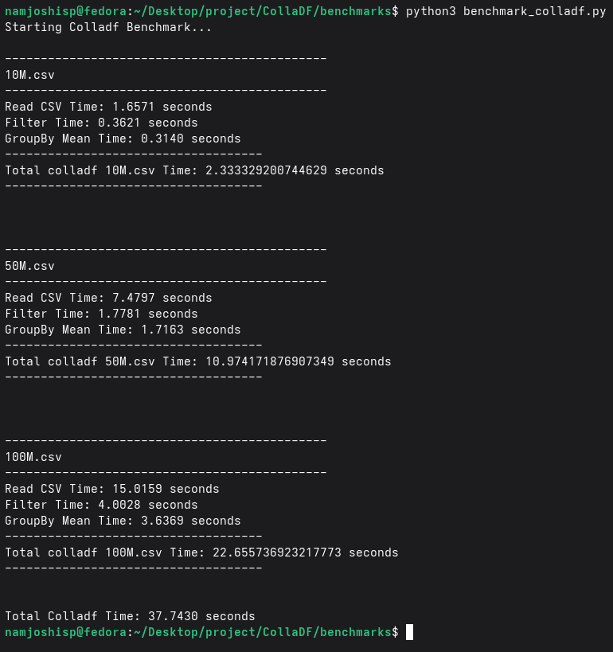
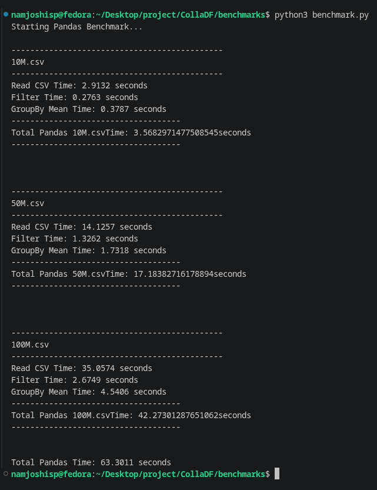

***

# 🚀 CollaDF: High-Performance C++ Data Manipulation Toolkit


**CollaDF** is a lightweight, fast, and heavily optimized Data Manipulation and Analysis toolkit written entirely in C++. It provides an intuitive API for filtering, grouping, and aggregating data, leveraging low-level C++ features like **Memory-Mapped I/O (`mmap`)**, **Type Erasure**, and **Contiguous Memory Allocation** to achieve extremely fast data pipeline execution.

This project was built to demonstrate proficiency in core C++ concepts, memory management, and data structure design, focusing on a subset of the most critical data operations required in Data Engineering and Machine Learning pipelines.

---

## ⚡ Performance Benchmarks

CollaDF was benchmarked against Python's pandas on three large CSV datasets (10 Million, 50 Million, and 100 Million rows). The dataset was generated using a python script (`generate_data.py`).
You can download the generated **`.csv`** files from this [drive](https://drive.google.com/drive/u/3/folders/1peQ5oF7KYHM9peqFqEsUpNimK9fwIO5W) link.


**Key Takeaway:** CollaDF is **~2.3x faster at reading CSV files** due to custom Memory-Mapped I/O (`mmap`) and zero-copy string views, resulting in an overall faster pipeline execution time (33% faster total time on 100M rows).


### Comparison Table

| Dataset Size | Operation | CollaDF (C++) | Pandas (Python) | Speedup / Note |
| :--- | :--- | :--- | :--- | :--- |
| **10M Rows** | Read CSV | **1.65 s** | 2.91 s | CollaDF is ~1.8x faster |
| | Filter (`>`) | 0.36 s | **0.27 s** | Pandas is ~2.3x faster |
| | GroupBy Mean | **0.31 s** | 0.38 s | Equal performance |
| | **Total Time** | **2.33 s** | 3.56 s | **CollaDF is ~36% faster overall** |
| | | | | |
| **50M Rows** | Read CSV | **7.48 s** | 14.12 s | CollaDF is ~1.9x faster |
| | Filter (`>`) | 1.78 s | **1.32 s** | Pandas is ~2.1x faster |
| | GroupBy Mean | 1.71 s | **1.73 s** | Pandas is ~1.1x faster |
| | **Total Time** | **10.97 s** | 17.18 s | **CollaDF is ~41% faster overall** |
| | | | | |
| **100M Rows**| Read CSV | **15.01 s** | 35.05 s | CollaDF is ~2.3x faster |
| | Filter (`>`) | 4.00 s | **2.67 s** | Pandas is ~2.8x faster |
| | GroupBy Mean | 3.63 s | **4.54 s** | Pandas is ~1.2x faster |
| | **Total Time** | **22.65 s** | 42.27 s | **CollaDF is ~50% faster overall** |

*Note: The C++ is binded into python colla_df library using Pybind you can find setup.cpp file as well as pybind_wrapper.py containing the bnding code as well as cmake.*

---

## 🛠️ System Architecture & Technical Highlights

To achieve this performance and maintain a clean API, CollaDF utilizes several advanced C++ paradigms:

*   **Memory-Mapped I/O (`sys/mman.h`)**: Bypasses standard `std::ifstream` overhead by mapping the CSV directly into the CPU's virtual address space, allowing zero-copy parsing via `std::string_view`.
*   **Type Erasure & Polymorphism**: Uses a base `Series` class with a templated `Column<T>` implementation. This allows the `DataFrame` to store heterogenous columns (Int, Double, String) in a single `std::unordered_map<std::string, std::shared_ptr<Series>>`.
*   **Variant & Compile-Time Type Checking**: Uses `std::variant<int64_t, double, std::string>` for scalar values and `if constexpr` for compile-time branch optimization during aggregations and math operations.
*   **Custom Hashing (`VectorHash`)**: Implemented a bitwise-optimized hash function (using golden ratio bit-shifting) to allow `std::unordered_map` to group by multiple columns simultaneously.
*   **Operator Overloading**: Overloaded operators (`+`, `-`, `>`, `==`, `&`, `|`) to provide an intuitive syntax for boolean masking and vector math.

---

## 💻 Quick Start & Usage

### 1. Loading and Inspecting Data
```cpp
#include "colladf/Reader.hpp"
#include "colladf/DataFrame.hpp"

// Fast loading via Memory Mapping
DataFrame df = Reader::read_csv("data.csv");

// Inspect the dataset
df.head(5).describe();
```

### 2. Filtering (Boolean Masking)
```cpp
// Combine masks using overloaded & and | operators
std::vector<bool> mask = (df["department"] == "Engineering") & (df["salary"] > 80000);

// Apply mask to create a new subset DataFrame
DataFrame rich_engineers = df[mask];
```

### 3. GroupBy & Aggregations
```cpp
#include "colladf/GroupBy.hpp"

// Single column grouping
DataFrame dept_avg = df.groupby("department").mean("salary");

// Multi-column grouping
DataFrame complex_group = df.groupby({"department", "name"}).max("rating");
```

### 4. Vectorized Arithmetic
```cpp
// Broadcast scalar addition
DataFrame boosted_salary = df["salary"] + 5000;

// Column-to-Column arithmetic
DataFrame metric = df["salary"] / df["rating"];
```

---

## 🏗️ Building and Testing

The project uses standard C++17 and `gtest` for unit testing. 

```bash
# Clone the repository
git clone https://github.com/yourusername/CollaDF.git
cd CollaDF

# Build the project (Assuming standard CMake setup)
mkdir build && cd build
cmake ..
make

# Run the unit tests
./run_tests

# Run the benchmark suite
./benchmark_colladf
```


## Build using python

Run command using python
```python
python setup.py build_ext --inplace
```
This will create a colla_df.so file for you you can import colla_df as cdf to use it  

---
### Console Outputs

<br>


## 🔮 Future Enhancements (Roadmap)

While the current MVP excels in I/O and provides core operations, future updates will focus on:
1.  **SIMD Vectorization**: Utilizing AVX2/AVX-512 intrinsics to speed up the boolean filtering operations.
2.  **Multithreading**: Implementing `std::async` or a Thread Pool for parallel CSV parsing and parallel group-by aggregations.
3.  **Null Value Handling**: Introducing bitmasks to safely and efficiently handle missing data (`NaN`).

---
